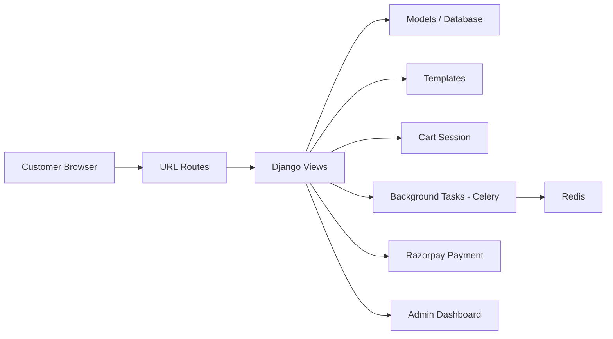
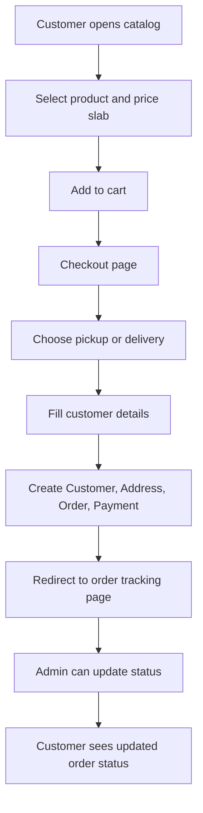

# SMK Flour Shop - Project Documentation

This project is a simple but complete online ordering website for a flour shop. It lets customers browse products, add items to the cart, choose pickup or home delivery, place an order, and track its status.

The project is built using Django, SQLite/MySQL, Celery, Redis, Razorpay, and HTMX + Alpine.js for the frontend.

## Quick Jump / Table of Contents

- [1. What this project is](#1-what-this-project-is)
- [2. Project goal in plain English](#2-project-goal-in-plain-english)
- [3. High-level architecture](#3-high-level-architecture)
- [4. Main folder explanation](#4-main-folder-explanation)
- [5. Important database models](#5-important-database-models)
- [6. How the app works from the user side](#6-how-the-app-works-from-the-user-side)
- [7. User guide](#7-user-guide)
- [8. How to run the app](#8-how-to-run-the-app)
- [9. Environment configuration](#9-environment-configuration)
- [10. How to customize this project](#10-how-to-customize-this-project)
- [11. Where to modify code safely](#11-where-to-modify-code-safely)
- [12. Common issues and how to fix them](#12-common-issues-and-how-to-fix-them)
- [13. Production readiness notes](#13-production-readiness-notes)
- [14. Recommended next improvements](#14-recommended-next-improvements)
- [15. Quick developer checklist](#15-quick-developer-checklist)
- [16. Summary](#16-summary)

---

## 1. What this project is

Think of this as a small online storefront for a local shop.

Customers can:
- open the catalog page,
- choose products and quantity,
- add items to a cart,
- place an order,
- choose delivery or pickup,
- see order tracking,
- log in with OTP-like mobile number flow,
- view their old orders.

Shop owners/admins can:
- manage categories, products, and price slabs,
- create orders from the admin panel,
- update order status,
- track payments,
- see live order dashboard.

---

## 2. Project goal in plain English

The app helps a local flour shop sell products online without needing a heavy frontend framework.

It is designed to be:
- easy to understand,
- easy to customize,
- easy to host locally or in Docker,
- good for small businesses improving their order workflow.

---

## 3. High-level architecture

The project follows the common Django MVC-style structure:

- Models = database tables and logic
- Views = request handlers
- Templates = page layout and UI
- URLs = routing
- Static files = CSS, images, JS
- Celery tasks = background job processing

### Simple architecture diagram



### End-to-end order flow diagram



---

## 4. Main folder explanation

### Root files

- `manage.py` - starts the Django project and runs commands.
- `requirements.txt` - Python packages required by the app.
- `Dockerfile` - container build instructions.
- `docker-compose.yml` - starts web, DB, Redis, and Celery containers.
- `db.sqlite3` - local SQLite database used by default.

### Main project package

- `smk_flour_shop/settings.py` - project settings such as database, static/media folders, Celery, site URL, and Razorpay keys.
- `smk_flour_shop/urls.py` - entry URLs for the Django project.
- `smk_flour_shop/celery.py` - Celery setup.

### App folder

- `shop/models.py` - all database models such as `Shop`, `Category`, `Product`, `PriceSlab`, `Customer`, `Address`, `Order`, `OrderItem`, `Payment`.
- `shop/views.py` - all major business logic for catalog, cart, checkout, payment, OTP login, admin dashboard.
- `shop/urls.py` - frontend URL patterns for the user-facing app.
- `shop/admin.py` - admin interface customization.
- `shop/context_processors.py` - shared cart and customer data made available to templates.
- `shop/signals.py` - listens for order status changes and triggers notifications.
- `shop/tasks.py` - Celery task code for payment webhook handling and notification simulation.

### Frontend folders

- `templates/` - page templates.
- `static/css/index.css` - CSS theme, layout, and styling.
- `media/` - uploaded product images and generated QR codes.

---

## 5. Important database models

The app uses a simple store database structure.

### Shop
Stores the physical shop details and a QR code image.

### Category
Groups products in the front catalog.

### Product
Main product record.

### PriceSlab
Pricing for different quantities and units.
Example:
- ₹30 for 600 ml
- ₹60 for 1 litre

This is very important because the product is not priced once. Instead, each product can have many quantity-based price options.

### Customer
Stores customer mobile number and name.

### Address
Stores delivery address and coordinates.

### Order
Represents one order order request.

### OrderItem
Each item inside an order.

### Payment
Tracks payment method and status.

---

## 6. How the app works from the user side

### Customer flow

1. Open the site homepage.
2. Browse categories and products.
3. Pick a quantity and click Add to Cart.
4. The cart drawer opens or updates.
5. Go to checkout.
6. Enter name and phone number.
7. Choose:
   - pickup, or
   - home delivery.
8. For delivery, the app can use GPS to estimate the location.
9. The system calculates delivery distance and fee.
10. The order is saved.
11. The customer sees the tracking page.

### Admin flow

1. Log in to Django admin.
2. Add/edit shop, categories, products, prices, and stock status.
3. View orders and update order status.
4. Review payment status.
5. Use the custom admin dashboard to see live order activity.

---

## 7. User guide

## For customers

### Browse the menu
- The home page shows categories and product cards.
- Each product can display English and Tamil names.
- Each product can have multiple quantity slabs.

### Add items to cart
- Choose a price slab.
- Click Add to Cart.
- Cart updates quickly without full page reload using HTMX.

### Checkout
- Enter your name and phone number.
- Choose pickup or delivery.
- For home delivery, allow location permission or manually place the marker on the map.
- The app calculates delivery distance and fee.

### Login / OTP
- The login page asks for a mobile number.
- The code is sent in a simulated way during development.
- In development mode, the OTP is shown in the terminal and on the login page preview box.

### Track order
- After order placement, the user is redirected to the order tracking screen.
- The order status can move between:
  - received
  - preparing
  - ready
  - completed
  - cancelled

---

## 8. How to run the app

## Option A: Run locally using Python and SQLite

1. Create a virtual environment:

```bash
python3 -m venv .venv
source .venv/bin/activate
```

2. Install dependencies:

```bash
pip install -r requirements.txt
```

3. Run Django migrations:

```bash
python manage.py migrate
```

4. Create a superuser for admin:

```bash
python manage.py createsuperuser
```

5. Start the server:

```bash
python manage.py runserver
```

6. Open:

- http://127.0.0.1:8000/
- http://127.0.0.1:8000/admin/

---

## Option B: Run using Docker Compose

1. Build and start containers:

```bash
docker-compose up --build
```

2. Run migrations inside the container:

```bash
docker-compose exec web python manage.py migrate
```

3. Create admin:

```bash
docker-compose exec web python manage.py createsuperuser
```

4. Visit the app at:

- http://127.0.0.1:8000/

---

## 9. Environment configuration

The app uses `django-environ` and reads values from `.env` if present.

Important variables:

- `SECRET_KEY`
- `DEBUG`
- `ALLOWED_HOSTS`
- `DB_ENGINE`
- `DB_NAME`
- `DB_USER`
- `DB_PASSWORD`
- `DB_HOST`
- `DB_PORT`
- `CELERY_BROKER_URL`
- `CELERY_RESULT_BACKEND`
- `RAZORPAY_KEY_ID`
- `RAZORPAY_KEY_SECRET`
- `SITE_URL`

### Example `.env`

```env
SECRET_KEY=your-secret-key
DEBUG=True
ALLOWED_HOSTS=localhost,127.0.0.1
DB_ENGINE=sqlite
CELERY_BROKER_URL=redis://127.0.0.1:6379/0
CELERY_RESULT_BACKEND=redis://127.0.0.1:6379/0
RAZORPAY_KEY_ID=your_key_id
RAZORPAY_KEY_SECRET=your_key_secret
SITE_URL=http://127.0.0.1:8000
```

---

## 10. How to customize this project

## Change the shop branding

Edit files in the template and CSS layers:

- `templates/base.html` for header, hero section, and shared structure
- `static/css/index.css` for theme colors and responsiveness

To change brand text, update:
- shop name,
- address,
- hero subtitle,
- welcome text,
- theme colors.

---

## Change product data

Use Django admin:

- `Category`
- `Product`
- `PriceSlab`

This is the easiest place to add products, descriptions, and quantities.

---

## Change delivery logic

Open `shop/views.py` in the `calculate_distance()` and `checkout()` sections.

You can modify:
- delivery radius (currently 10 km),
- delivery fee formula,
- map coordinate rules,
- GPS behavior.

---

## Change payment behavior

Payment is integrated with Razorpay.

If you want to enable real payment:
1. add valid Razorpay keys,
2. configure webhook secret,
3. use a real-live payment environment.

If keys are not set, the app falls back to sandbox-like logic.

---

## Change the notification system

The project simulates SMS/WhatsApp style notifications in `shop/tasks.py`.

Right now it logs the message instead of sending a real SMS.

You can connect it to:
- Twilio,
- Fast2SMS,
- WhatsApp API,
- your own message provider.

---

## Change the UI language

The frontend already uses both English and Tamil labels.

You can customize the text directly in:
- `templates/shop/catalog.html`
- `templates/shop/checkout.html`
- `templates/base.html`
- `templates/shop/login.html`

---

## 11. Where to modify code safely

### If you want to change the catalog page
Edit `templates/shop/catalog.html`.

### If you want to change the checkout behavior
Edit `shop/views.py` and `templates/shop/checkout.html`.

### If you want to change order logic
Edit `shop/models.py` and `shop/views.py`.

### If you want to change style/theme
Edit `static/css/index.css`.

### If you want to change database schema
Edit `shop/models.py`, then run:

```bash
python manage.py makemigrations
python manage.py migrate
```

---

## 12. Common issues and how to fix them

## Issue 1: App does not start

### Why
- Python dependencies are not installed.
- Virtual environment is missing.
- SQLite or MySQL config is not correct.

### Fix
```bash
pip install -r requirements.txt
python manage.py migrate
```

---

## Issue 2: Database errors

### Why
- Migrations are not applied.
- Database connection settings are wrong.

### Fix
```bash
python manage.py migrate
```

If using MySQL, verify the environment values in `.env` or Docker Compose.

---

## Issue 3: Static CSS or images not loading

### Why
- `DEBUG` may be false in production.
- Static files need to be collected.

### Fix
```bash
python manage.py collectstatic
```

---

## Issue 4: Payment not working

### Why
- Razorpay keys are missing or invalid.
- Webhook secret is not configured.

### Fix
- Add correct `RAZORPAY_KEY_ID` and `RAZORPAY_KEY_SECRET`.
- Keep the app in sandbox/test mode while developing.
- Ensure the app has internet access to talk to Razorpay.

---

## Issue 5: Delivery fee not calculated

### Why
- GPS latitude/longitude information is missing.
- Shop coordinates in the database are not updated.

### Fix
- Set the shop address and coordinates in the admin panel.
- Make sure the customer allows location permission on the browser.

---

## Issue 6: OTP screen shows wrong behavior

### Why
- The project uses a sandbox simulation for OTP.
- It is designed for local testing, not production SMS.

### Fix
- In development, use the preview OTP shown on page or in terminal.
- For real production, connect a real SMS provider (Twilio / Fast2SMS).

---

## Issue 7: Celery tasks not running

### Why
- Redis is not running.
- Celery worker is not started.

### Fix
Start Redis and Celery separately:

```bash
redis-server
celery -A smk_flour_shop worker --loglevel=info
```

Or use Docker Compose.

---

## 13. Production readiness notes

This is a good project for a local business or small MVP, but not yet a full enterprise production setup.

For production, you should also add:
- real HTTPS,
- secure env variables,
- production database,
- real SMS provider,
- real payment webhook verification,
- backups,
- logging and monitoring,
- static file hosting,
- admin security hardening.

---

## 14. Recommended next improvements

If you want to make the project better, these are smart upgrades:

- Add inventory management.
- Add stock decrease after order placement.
- Add real payment flow and webhook verification.
- Add a dedicated delivery staff dashboard.
- Add invoice and PDF generation.
- Add real SMS integration.
- Add analytics charts.
- Add order search filters and exports.
- Add product image gallery and category management.

---

## 15. Quick developer checklist

Before you launch the app:

- [ ] Install requirements
- [ ] Run migrations
- [ ] Create superuser
- [ ] Configure environment variables
- [ ] Start Redis
- [ ] Start Celery worker
- [ ] Verify homepage loads
- [ ] Verify admin login works
- [ ] Test cart and order workflow
- [ ] Test delivery mode and GPS flow
- [ ] Test payment sandbox flow

---

## 16. Summary

This repository is a small Django-based online shop platform for a flour business. It combines:

- product catalog,
- cart management,
- checkout,
- pickup and delivery options,
- order tracking,
- mobile OTP login simulation,
- admin dashboard,
- payment integration,
- background job processing.

In simple words:

It is a business-ordering system that helps a local store take orders online, manage them, and track delivery status.

If you want, the next step can be to add a proper production-ready deployment guide, a database schema diagram, or a more formal architecture document for this project.
