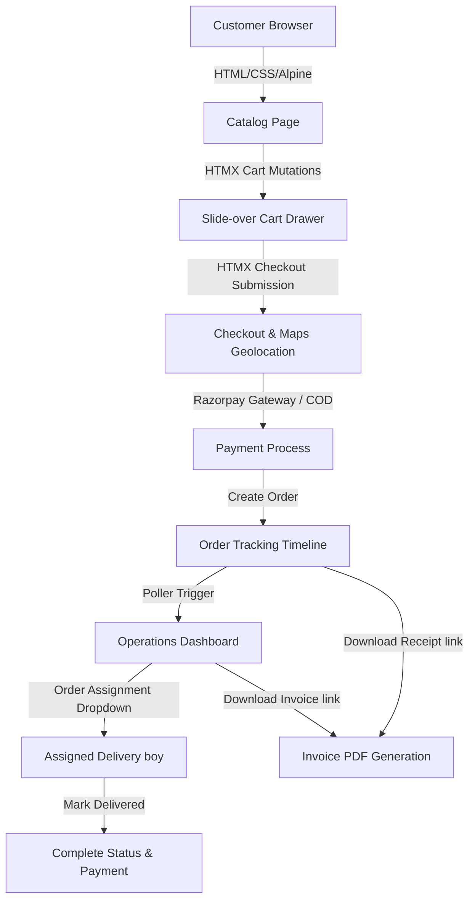
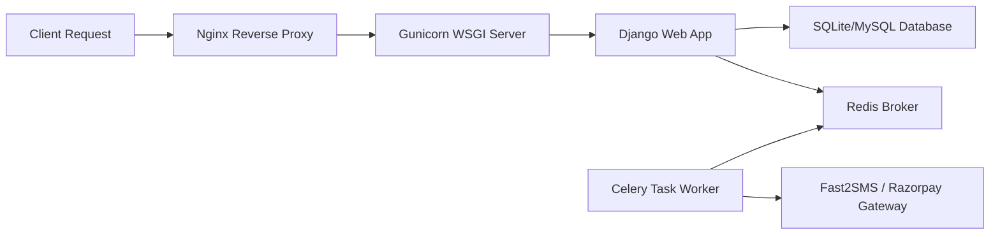

# SMK Flour Shop (SMK மாவு கடை) - Enterprise Storefront

A modern, high-performance, and feature-rich online ordering storefront and operations system custom-built for a local flour business. This platform allows customers to order batters, podis, and sweets, while providing administrators and delivery personnel with real-time operations dashboards, business analytics, and billing infrastructure.

Built using **Django 4.2**, **SQLite/MySQL**, **Celery**, **Redis**, **Razorpay**, and a premium **HTMX + Alpine.js** frontend with custom Apple-inspired glassmorphic styles.

---

## Table of Contents

- [1. Core Platform Upgrades & Features](#1-core-platform-upgrades--features)
- [2. High-Level System Architecture](#2-high-level-system-architecture)
- [3. Code Directory & Core Modules Reference](#3-code-directory--core-modules-reference)
- [4. Project Database Models](#4-project-database-models)
- [5. Setting Up and Running Locally](#5-setting-up-and-running-locally)
- [6. Deploying to EC2 Staging/Production](#6-deploying-to-ec2-stagingproduction)
- [7. Environment Configuration Variables](#7-environment-configuration-variables)
- [8. Customizing & Extending the Application](#8-customizing--extending-the-application)

---

## 1. Core Platform Upgrades & Features

### 🛒 Dynamic HTMX Slide-Over Cart Drawer
* **Seamless Mutations**: Add, increment, decrement, and remove items directly in the cart drawer without full-page refreshes. Uses an explicit absolute-layout system to prevent flexbox rendering reflow bugs on Safari/Chrome.
* **Smart UI States**: Toggles between bilingual layouts automatically based on selected language configuration.

### 📦 Automated Stock Control System
* **Packaged vs Bulk Stocks**:
  * **Packaged Products** (e.g. Sweet Paniyaram, packets): Validated and tracked individually at the **Price Slab** level.
  * **Bulk Products** (e.g. Dosa Batter, powders, curries): Validated and tracked collectively at the **Product** level. Multiple slab quantities in the cart (e.g. 1.0 kg and 2.0 kg) sum up and deduct from the same shared product bulk stock.
* **Unit Normalization**: Automatically normalizes all values to base metrics (grams for mass, millilitres for volume) to ensure error-free checks (e.g., comparing a 2 kg bulk stock against a 500g slab).
* **Real-time Validation**: Caps quantities added to the cart at the product's max available stock limit.
* **Bilingual Warnings**: Displays automated visual warnings if request sizes are capped due to inventory limits.
* **Auto-Deductions**: Instantly deducts purchased quantities from active product slabs upon checkout.
* **Auto-Restoration**: Restores stock inventory values if an order is cancelled from the Operations Dashboard.
* **Operations Configuration**: Toggle stock types, change units, adjust stock levels inline, add new products, add price slabs, or reset all stocks to 0 directly from the Operations Panel.

### 📊 Business Analytics Dashboard
* **Daily Sales Trend**: Interactive Line Chart tracking total sales revenue over the past 7 days.
* **Order Velocity**: Interactive Bar Chart tracking hourly order distributions for the current day.
* **Product Distribution**: Interactive Doughnut Chart showing share percentages of top 5 best-selling products.
* *Powered by Chart.js CDN, responsive across all screen dimensions.*

### 📄 Billing & PDF Invoice Infrastructure
* **Programmatic Receipts**: Generates clean, structured invoice PDFs on the fly using `reportlab`.
* **Bilingual-Safe Layouts**: Pre-formats product items using their English names (`name_en`) to prevent any missing font glyph/Unicode crashes.
* **Easy Access**: Customers can download invoices from the Order Tracking and My Orders pages, and staff can download them from the Operations Dashboard.

### 🛵 Dedicated Delivery Staff Dashboard
* **Secure Access**: Restricted to users assigned to the `"Delivery Staff"` Group or superusers.
* **Mobile-First Layout**: Fast login and card-based orders tracking panel optimized for smartphone viewports.
* **One-Click Actions**: Single-tap phone dials (`tel:`) and Google Maps route navigation.
* **Instant Delivery Updates**: Double-click "Mark Delivered" transitions status to Completed and marks Cash on Delivery payments as Completed automatically.

---

## 2. High-Level System Architecture

### Application Workflow Diagram



### Server Execution Diagram



---

## 3. Code Directory & Core Modules Reference

To modify or inspect specific components of the shop, use the references below:

* **Database Models**: [shop/models.py](shop/models.py) – Contains schemas for Customer, Address, Order, PriceSlab, and Payment.
* **Business Logic Views**: [shop/views.py](shop/views.py) – Contains operations logic for checkout, cart mutations, pdf generator, and dashboards.
* **URL Router Paths**: [shop/urls.py](shop/urls.py) – Maps routing URLs for dashboard, delivery portal, tracking, and download endpoints.
* **Theme Styling & Tokens**: [static/css/index.css](static/css/index.css) – Handles layout grids, animations, color tokens, and layout positioning.
* **Base Core Template**: [templates/base.html](templates/base.html) – The main wrapper containing script dependencies, theme switches, and the slide-over drawer structure.
* **Operations Panel**: [templates/shop/admin_dashboard.html](templates/shop/admin_dashboard.html) – Dashboard UI displaying active order tables, live Leaflet tracking map, and Chart.js canvases.
* **Delivery Dashboard**: [templates/shop/delivery_dashboard.html](templates/shop/delivery_dashboard.html) – Mobile portal for delivery staff to complete tasks.

---

## 4. Project Database Models

The schema structure maps products dynamically based on quantities and packs:

```
[Category] ── (1:N) ──> [Product] ── (1:N) ──> [PriceSlab (Tracks individual price & stock)]
                                                    │
                                                  (1:N)
                                                    ▼
[Customer] ── (1:N) ──> [Order]  ── (1:N) ──> [OrderItem]
   │                       │
 (1:N)                   (1:1)
   ▼                       ▼
[Address]               [Payment (Tracks COD vs Razorpay statuses)]
```

---

## 5. Setting Up and Running Locally

Follow these steps to run the application on your local machine using a virtual environment and local SQLite database:

### Prerequisites
* Python 3.9 or higher
* Redis Server installed and running (Required for Celery background tasks)

### Step 1: Clone and Set Up Virtual Environment
```bash
# Create virtual environment
python3 -m venv venv

# Activate virtual environment
source venv/bin/activate
```

### Step 2: Install Required Packages
```bash
pip install -r requirements.txt
```

### Step 3: Configure Environment File
Create a `.env` file in the root folder (or copy `.env.example`):
```env
SECRET_KEY=dev-secret-key-smk
DEBUG=True
ALLOWED_HOSTS=localhost,127.0.0.1
DB_ENGINE=sqlite
CELERY_BROKER_URL=redis://127.0.0.1:6379/0
CELERY_RESULT_BACKEND=redis://127.0.0.1:6379/0
SITE_URL=http://localhost:8000
```

### Step 4: Run Migrations and Init User Groups
```bash
# Run Django database migrations
python manage.py migrate

# Initialize default "Delivery Staff" auth group
python manage.py shell -c "from django.contrib.auth.models import Group; Group.objects.get_or_create(name='Delivery Staff')"
```

### Step 5: Create Admin Superuser
```bash
python manage.py createsuperuser
```

### Step 6: Start Services
Start your Redis server, Celery worker, and Django server in separate terminal tabs:

**Tab 1: Redis Server**
```bash
redis-server
```

**Tab 2: Celery Background Task Worker**
```bash
source venv/bin/activate
celery -A smk_flour_shop worker --loglevel=info
```

**Tab 3: Django Development Server**
```bash
source venv/bin/activate
python manage.py runserver
```

Now open your browser and navigate to:
* Storefront Catalog: [http://localhost:8000](http://localhost:8000)
* Operations Dashboard: [http://localhost:8000/admin-dashboard/](http://localhost:8000/admin-dashboard/)
* Delivery Boy Dashboard: [http://localhost:8000/delivery/login/](http://localhost:8000/delivery/login/)

---

## 6. Deploying to EC2 Staging/Production

For production hosting, the app is containerized using **Docker** and **Docker Compose** to run Django (via Gunicorn), Nginx, Redis, and MySQL:

### Step 1: Update code on the EC2 Server
Connect to your EC2 instance and pull the latest codebase updates:
```bash
git pull origin main
```

### Step 2: Build and Build Container Images
```bash
docker compose build
```

### Step 3: Launch Services in Background
```bash
docker compose up -d
```

### Step 4: Apply Database Migrations inside Web Container
```bash
docker compose exec web python manage.py migrate
```

---

## 7. Environment Configuration Variables

* `SECRET_KEY`: Django cryptographic signing secret key.
* `DEBUG`: Toggle development traceback screen display (`True` / `False`).
* `SITE_URL`: Base domain link (e.g. `https://smkmaavukadai.com` or `http://localhost:8000`) for generating dynamic QR codes pointing to order paths.
* `RAZORPAY_KEY_ID` & `RAZORPAY_KEY_SECRET`: Live credentials to connect payment processing gateway (falls back to mock sandbox if empty).
* `FAST2SMS_API_KEY`: API key to trigger real SMS OTP validation (uses fallback previews if empty).

---

## 8. Customizing & Extending the Application

* **Add New Slabs/Products**: Access Django Admin console at `/admin/` and configure product inline blocks.
* **Adjust Delivery Fees**: Open `shop/views.py` and modify the distance multiplier logic within the `calculate_delivery` endpoint.
* **Integrate Custom SMS gateway**: Open `shop/tasks.py` and modify the SMS dispatcher block inside the worker tasks.
